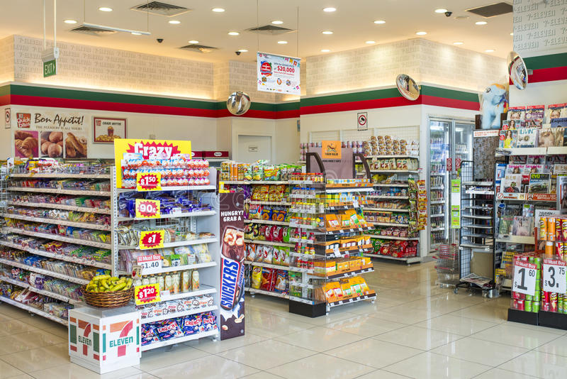

# Simple-Sales-Report

Impact of sales person and territory on Revenue generation

## Introduction
This is a case study on revenue generation of an imaginary store. This case study is to analyse the impact of *Sales Persons* and *geolocations* on revenue. To identify product performance and safe cost by optimizing the inventory.

## Problem Statement 
1. Which Sales Person has the highest impact on revenue generation.
2. What is the store valuation.
3. Top  performing products.

## Skills Demonstrated
Power BI DAX functions and SQL was utilized to extract sales persons deatils from Adventure works 2019 OLTP version database

## Modelling 
Necessary relationships were established using primary keys and unique identifiers within a star schema.

## Visualization 
This is a single page report to visualize revenue and profit generated by the store with respect to each Sales person, products and geolocation of coverage.
You can interact with the product [here]()

## Analysis 
### Store Overview
the store currently have a total of 19.82k customers,31.47k orders were made between year 2011 and 2014 with $110.37M revenue generated between this period.

### Product Performance
there are 275k SKUs in the store with valuation worth of $100.47M. Mountain -200 Black,38 in product category bike is the top top performing product with revenue genration to the tune of $4.4M having sold 2,977 units.

### Geographical Impact
North America happen to be the the most profitable region with $79.7M revenue boost
Linda C Mitchel is the top performing sales person

